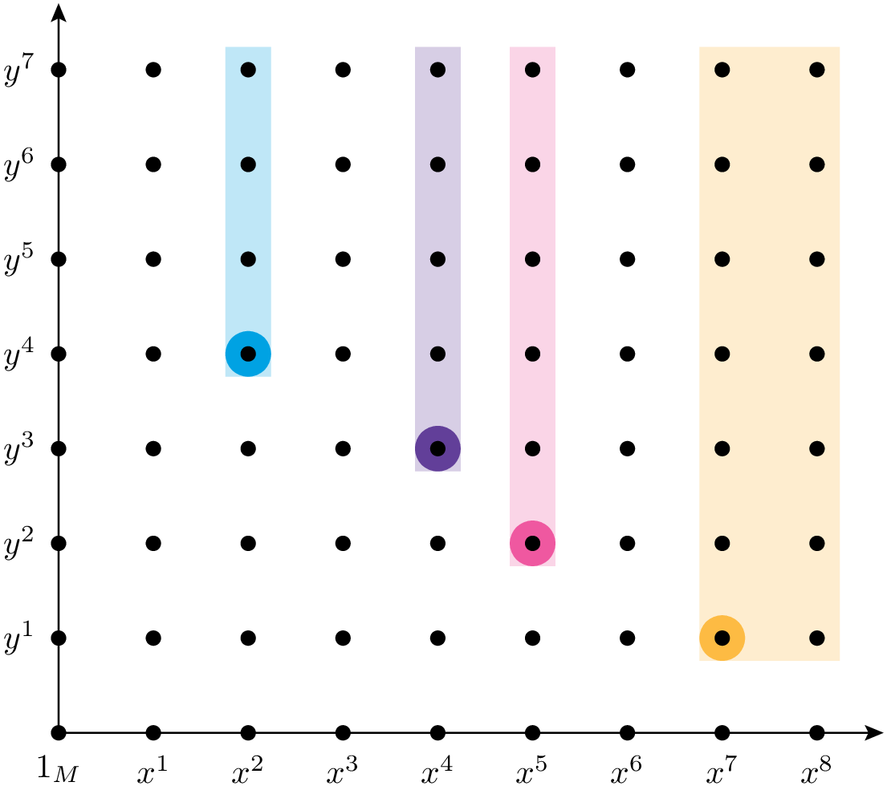
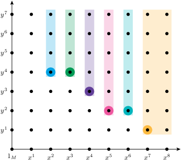
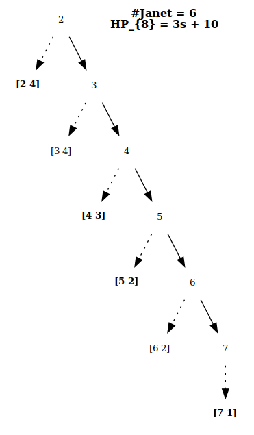
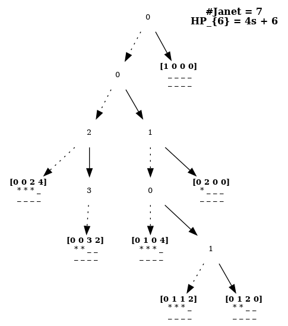
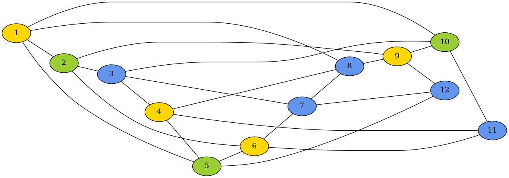

# PyGInv: исследование и решение полиномиальных и дифференциальных систем

**Ю. А. Блинков**  
E-mail: blinkovua@info.sgu.ru

**Аннотация:**  
Представлены вычисления в пакете PyGInv базисов Грёбнера в полиномиальных и дифференциальных системах и построении численных схем. Результаты позволяют найти размерность пространства решений. Численно найти все решения в полиномиальном случае для нульмерных идеалов. Вычислить симметрии дифференциальных уравнений без использования специальных формул. Проводить преобразования с разностными схемами, например, в случае компактных разностных схем. Пакет PyGInv представляет собой облегчённый вариант GInv, написанный на чистом Python и интегрирован с системой компьютерной алгебры SymPy.

**Ключевые слова:** компьютерная алгебра, базисы Грёбнера, полиномиальные системы, дифференциальные уравнения

## Базисы Грёбнера

Исторически, работы в направлении создания теории базисов Гребнера были ориентированы на конструктивное решение задачи принадлежности к идеалу [1-4].

Альтернативный подход методу базисов Грёбнера сформировался при исследовании дифференциальных уравнений [5-7]. Он был ориентирован на приведение системы к виду, по которому можно было определить размерность пространства решений.

Разницу между между базисами Грёбнера и его расширением инволютивным базисом лучше всего продемонстрировать на рисунке 1. На левом рисунке разном цветом показаны конуса из делимых мономов. В результате фиксирования упорядочения мономов в общем полиномиальном случае на месте пересечения конусов необходимо вычислить S-полиномы по текущему базису и добавить их в базис. По окончание этого процесса будет получен базис Грёбнера в выбранном порядке. Теперь для определения принадлежности достаточно вычислить значение полинома по текущему базису. При этом последовательность редукций не важна, поскольку все S-полиномы уже принадлежат базису. В данном случае легко посчитать полином Гильберта HP₈ = 3s + 10, который состоит из трех одномерных конусов x^s, y^s, xy^s и некоторого количества мономов, которые в эти конуса не попадают 1_ℳ, x, y, x², xy, ... В результате формула HP₈ = 3s + 10 подобрана так, что дает точное значение мономов до полной степени s ≥ 8, которые не имеют делителя среди элементов базиса.






В общем случае такой подсчет затруднительно сделать. Если бы конуса не пересекались, то вычисление полинома Гильберта можно представить разность конуса с единичного монома 1_ℳ и суммы по всем конусам образованными мономами базиса.

Инволютивное разбиение переменных переменных Janet запрещает деление по переменным, называемым немультикативными. В результате конуса на рисунке 2 не пересекаются, но и имеются незаполненные конусы. На рисунке 3 представлен базис приведенный в инволюцию за счет пополнения текущего базис продолжениями по немультикативным переменным. Инволютивный подход к построение базисов Грёбнера был развит в работах [8-10].

## PyGinv

PyGInv представляет собой "легковесную" версию GIinv [11, 12] (сокращение от Gröbner INVolutive). Написана на "чистом" Python и использует систему компьютерной алгебры SymPy (https://www.sympy.org/) для работы с параметрами. По возможности PyGInv позволяет экспорт/импорт данных в SymPy. Для построения дерева Janet опционально используется пакет Graphviz (https://graphviz.org/).

В настоящее время PyGInv позволяет строить базисы Грёбнера для полиномов, модулей, линейных дифференциальных уравнений и линейных разностных схем. Во многих случаях, как будет показано ниже, можно работать и с нелинейными дифференциальными уравнениями и разностными схемами. PyGInv содержит дополнительные функции для исследования и решения полиномиальных и дифференциальных систем.

Исходный код представленный в четырех файлах (`monomial.py`, `polynomial.py`, `janet.py`, `ginv.py`) занимает чуть меньше 2000 строк кода. Все исходные файлы и файла примеров, в том числе, и изложенных ниже находятся по адресу https://github.com/blinkovua/GInv/tree/master/pyginv.

Используя отлаженный интерфейс PyGInv планируется частично перенести его в пакет GIinv написанный на C++11 и использующий собственный менеджер памяти [13] для символьных вычислений и "длинной" арифметики.

Все вычисления произведены на процессоре Intel(R) Core(TM) i7-4770K CPU @ 3.50GHz, с 16 G оперативной памяти в системе Debian 12.

## Полиномы и модули

Рассмотрим чисто мономиальный базис, рассмотренный на рисунках 1-3.

В строке 1 происходит импорт PyGInv в виде головного модуля `ginv.py`.

В 3 строке задается вид допустимого упорядочения. Сейчас реализованы `POTlex`, `TOPlex`, `POTdeglex` и `TOPdeglex`. В их именах `lex` означает лексикографическое, `deglex` по полной степени обратно-лексикографическое. Соответственно, `POT` -- позиция старше терма, а `TOP` -- терма старше позиции.

```python
from ginv import *

Monom.cmp = Monom.TOPdeglex
x, y = Poly.init('x, y'.split(', '))
mnm = Janet()
res = ginvBlockLow((x**7*y, x**5*y**2, \
   x**4*y**3, x**2*y**4), mnm, level=1)
mnm.saveImage('mnm.pdf')
```

Строка 4 задает переменные `x`, `y` с порядком $x \succ y$. Строка 5 определяет вид инволютивного деления, сейчас реализовано только деление Janet на основе бинарного дерева Janet~[1] представленного на рисунках 4, 5. Сохранение результата в виде дерева Janet происходит на строке 8. На строке 9-10 происходит вызов алгоритма `ginvBlockLow` реализующий блочную стратегию описанную в работе~[2], которая работает только в упорядочении `TOPdeglex`. Алгоритм `ginvMin` реализующий минимальную стратегию работает при все видах упорядочения.



На рисунках 4, 5 показаны разные уровни вывода информации. На рисунке отображена только структура дерева и жирным обозначены мономы принадлежащие базису редуцированному базиса Грёбнера, а простым шрифтом мономы которые принадлежат дополнительно минимальному инволютивному базису~[3].

Ниже на строках 1--17 продемонстрировано вычисление базиса Грёбнера для стандартного примера циклических корней. В данном случае полученный идеал является нульмерным $HP_{6}=4s+6$.

```python
Monom.cmp = Monom.TOPdeglex
x1, x2, x3, x4 = \
  Poly.init('x1, x2, x3, x4'.split(', '))
cyclic4 = Janet()
res = ginvBlockLow((
x1+x2+x3+x4,\
x1*x2+x2*x3+x3*x4+x4*x1,\
x1*x2*x3+x2*x3*x4+x3*x4*x1+x4*x1*x2,\
x1*x2*x3*x4-1), \
cyclic4, level=1)
print(f"    crit1: {res[1]}")
print(f"    crit2: {res[2]}")
print(f"     time: {res[0]:.2f} sec")
print(f"    count: {cyclic4.count()}")
print(f"reduction: {cyclic4.reduction()}")
print(f"       HP: {cyclic4.HP()}")
cyclic4.saveImage('cyclic4.pdf', level=3)
```

В строках 11--17 показан вывод различной информации связанной с вычислением. Их результат представлен ниже в строках 18--23.

```python
    crit1: 6
    crit2: 0
     time: 0.02 sec
    count: 7
reduction: 54
       HP: 4s + 6
```

На рисунке 5 дополнительно по сравнению ниже монома выведены его немультакативные переменные и построенные по ним продолжения. В самом низу записан "предок", по нему работают критерии Бухбергера~[4] и некоторые виды инволютивных делений~[5], пока нереализованные в PyGInv.



На строках 24--34 произведен вывод базиса Грёбнера. Используемая обертка в виде класса `Wrap` содержит много технической информации для эффективной организации вычислений.

```python
for w in cyclic4.GB():
    print(w.poly)
x3**2*x4**4 + x2*x3 + x2*x4*-1 + x3*x4 + \
  x4**2*-2
x3**3*x4**2*-1 + x3**2*x4**3*-1 + x3 + x4
x2*x4**4*-1 + x4**5*-1 + x2 + x4
x2*x3*x4**2 + x3**2*x4**2 + x2*x4**3*-1 + \
  x3*x4**3 + x4**4*-1 + -1
x2*x3**2*-1 + x3**2*x4*-1 + x2*x4**2 + x4**3
x2**2*-1 + x2*x4*-2 + x4**2*-1
x1 + x2 + x3 + x4
```

На строках 1--12 показана организация вычислений с помощью модуля сизигий для четвертых циклических корней. Для этого вводятся зависимые переменные на строке 2 с порядком переменных $f \succ p_1 \succ  p_2 \succ  p_3 \succ  p_4$. В модулях они играют туже роль, что функции в дифференциальных уравнениях и разностных схемах. Внутри это организованно в виде положительного числа, которое определяет позицию. Естественно они должны входить в выражение только линейно. В данном примере у нас по числу зависимых переменных 6 различных деревьев Janet. Поэтому на строке 6 используется обертка в виде класса `Forest`. Предполагается, что она будет работать на других видах инволютивных делений.

```python
var = 'x1, x2, x3, x4'.split(', ')
fun = 'f, p1, p2, p3, p4'.split(', ')
var, fun = Poly.init(var, fun)
x1, x2, x3, x4 = var
f, p1, p2, p3, p4 = fun
cyclic4 = Forest(Janet)
res = ginvMin((
f*(x1+x2+x3+x4)-p1,\
f*(x1*x2+x2*x3+x3*x4+x4*x1)-p2,\
f*(x1*x2*x3+x2*x3*x4+x3*x4*x1+x4*x1*x2)-p3,\
f*(x1*x2*x3*x4-1)-p4), \
cyclic4, level=1)
```

Для построения сизигий необходимо только выражения не содержащие зависимую переменную `f` поэтому цикл на строке 14 начинается с позиции 1. Для данной системы не потребовалось исключающего упорядочения. На строках 15--19 показан перевод вычислений в представление SymPy записанной в векторном виде.

```python
syzygy = []
for i in range(1, 5):
  for w in cyclic4[i].GB():
    syzygy.append(tuple(sympy.Add(\
*tuple(eval(f"{m.lcm(fun[k].lm())}*{c}") \
for m, c in w.poly if m.position() == k),\
   evaluate=False) for k in range(1, 5)))
syzygy   
```

$[ ( x_{3}^{2} x_{4}^{4} - x_{4}^{2},   x_{2} x_{3}^{2} x_{4}^{2} - x_{2} x_{4}^{4} - x_{3}^{2} x_{4}^{3} - x_{3} x_{4}^{4} + x_{3} + x_{4}, \\  - x_{2} x_{3}^{2} x_{4} + x_{2} x_{4}^{3} + x_{4}^{4} - 1,   x_{2} x_{3}^{2} - x_{2} x_{4}^{2} + x_{3}^{2} x_{4} - x_{4}^{3}),\\  ( x_{2} x_{3}^{2} + x_{3}^{2} x_{4},   - x_{2} x_{3} - x_{2} x_{4} - x_{3}^{2} - x_{3} x_{4}, \  x_{2} + x_{4},   0), \\  ( - x_{2} - x_{4},   - x_{2}^{2} x_{4}^{2} + 1,  x_{2}^{2} x_{4} + x_{2} x_{4}^{2},  - x_{2}^{2} - 2 x_{2} x_{4} - x_{4}^{2})]$

На строках 21--28 выполнена проверка правильности построения трех полученных сизигий.

```python
P = (x1+x2+x3+x4,\
x1*x2+x2*x3+x3*x4+x4*x1,\
x1*x2*x3+x2*x3*x4+x3*x4*x1+x4*x1*x2,\
x1*x2*x3*x4-1)
for syz in syzygy:
  print(sum(s*p for s, p \
    in zip(syz, P)).expand(), end=" ")
0 0 0
```

## Нахождение корней

В случае нульмерных идеалов возможно эффективное нахождение всех корней системы полиномов с учетом кратности. Рассмотрим простой пример

`{x^3 - y^2 + z - 1, y^3 - z^2 + x - 1, z^3 - x^2 + y - 1}`

с порядком переменных $x \succ y \succ z$, который в упорядочении `deglex` согласно первому критерию Бухбергера [1] является базисом Грёбнера. Минимальный инволютивный базис Janet содержит уже 13 элементов представленных только лидирующем (старшими) мономами

`{z^3, y z^3, y^2 z^3, y^3, x z^3, x y z^3, x y^2 z^3, x y^3, x^2 z^3, x^2 y z^3, x^2 y^2 z^3, x^2 y^3, x^3}`.

Применяя статическую функцию `gradus` класса `Monom` на строке 3 можно перебором по полной степени найти все мономы, которые не имеею делителя среди лидирующих мономов системы.

```python
rows, i = {}, 0
for d in range(8):
  for m in Monom.gradus(d):
    if not test.find(m):
      print(f"{m!r}", end=", ")
      rows[m] = i
      i += 1
```

На строке 5 организован вывод таких мономов во внутреннем представлении в виде списка степеней переменных. Их количество в точности равно значению полинома Гильберта $HP_{7}= 27$.

```
[0 0 0], 
[1 0 0], [0 1 0], [0 0 1], 
[2 0 0], [1 1 0], ... , [0 0 2], 
[2 1 0], [2 0 1], ... , [0 2 1], [0 1 2], 
[2 2 0], [2 1 1], ... , [0 2 2], 
[2 2 1], [2 1 2], [1 2 2], 
[2 2 2],
```

В результате после проведения всех редукций по базису Грёбнера (строка 17 вызов функции `NF`) для мономов от переменной $x$ до степени 26 включительно у нас могут возникнуть только мономы представленные на строках 8-14. Это дает возможность сопоставить каждой строке матрицы $x^d$. Аналогично можно для построения столбца `b` на строках 19-21 сопоставить моном $x^27$.

```python
A=[[0 for k in range(27)] for i in range(27)]
for d in range(27):
  for m, c in (x**d).NF(test):
    A[rows[m]][d] = c
b = [0 for i in range(27)]
for m, c in (x**27).NF(test):
  b[rows[m]] = c

A, b = sympy.Matrix(A), sympy.Matrix(b)
s = sympy.linsolve((A, b)).args[0]
p = x**27-sum(x**d*s[d] for d in range(27))
```

Решая средствами SymPy полученную систему в матричном виде найдем вид полинома принадлежащему базису рассматриваемого идеала только от одной переменной 

$x^{27} - 9 x^{24} + 29 x^{21} + 6 x^{19} - 53 x^{18} + 22 x^{17} - 63 x^{16} + 96 x^{15} - 149 x^{14} + 242 x^{13} - 261 x^{12} + 484 x^{11} - 545 x^{10} + 740 x^{9} - 908 x^{8} + 972 x^{7} - 1220 x^{6} + 1047 x^{5} - 1045 x^{4} + 943 x^{3} - 535 x^{2} + 422 x - 216$

Корни этого полинома можно найти используя функцию `nroots` системы компьютерной алгебры SymPy.

Более эффективное вычисления можно организовать используя матричное представления переменных для решения численно задачи на собственные значения. На строках 26--32 используя соотношение, что умножение мономов на переменную из строк 8--14 редуцируются относительно базиса Грёбнера снова к этому набору мономов построим матрицу для этой переменной.

```python
dct = [{}, {}, {}]
for k, v in rows.items():
  for i in range(3):
    for m, c in Poly(Monom(i)*k).NF(test):
      if c:
        dct[i][rows[m], v] = c
X, Y, Z = (SparseMatrix(27, 27, dct[i]) for i in range(3))
X*Y == Y*X and X*Z == Z*X and Z*Y == Y*Z
True
```

Матрицы имеют много нулевых элементов и не смотря на то, что не симметричны коммутируют друг с другом (строки 34-35).

Применяя библиотеку SciPy (https://scipy.org/) на строках 36--43 легко организовать вычисления собственных значений, которые в точности будут соответствовать корням исходной системы [2].

```python
import numpy as np
from scipy import linalg

A = np.empty((27, 27), dtype=np.float64)
for j in range(27):
  for k in range(27):
    A[j][k] = X[j, k]
print(linalg.eigvals(A))
```

Расчет 7-ых циклических корней в PyGInv занимает время 1225 сек. Данная система полиномов имеет 924 корня с учетом кратности. Расчет матричного представления занимает 366 сек. Заполняемость матриц выглядит следующим образом [69694, 68288, 66858, 65585, 62887, 51490, 18216], что составляет в процентах [8%, 8%, 8%, 8%, 7%, 6%, 2%]. Расчет собственных значений занимает всего 19 сек.


## Раскраска графов

Используя трюк Рабиновича [1] для представления неравенств за счет введения дополнительных переменных можно с помощью базисов Грёбнера решать задачу раскраски графов *n*-красками. Например в случае трех красок цвета для соседних вершины можно определить следующими полиномами

```python
Monom.cmp = Monom.POTlex
k, y, x = Poly.init('k, y, x'.split(', '))
test = Janet()
res = ginvMin((
x*(x+1)*(x-1),
y*(y+1)*(y-1),
(x - y)*k - 1,\
), test, level=1)
```

В последнем полиноме (строка 7) дополнительная переменная *k* не может обращаться в ноль и значит краски *x* и *y* различны. Базис Грёбнера после исключения полинома с *k* имеет следующий вид 
`x³ - x`, `y² + yx + x² - 1`, 
`2k - 3yx² + 2y - 2x`, где второй искомый полином разделяющий значения *x* и *y*.

С помощью этих соотношений можно описать все соседние вершины и построив базис Грёбнера найти все варианты раскраски данного графа.

Аналогично, например, для пяти красок можно определить следующую систему
`x(x+1)(x-1)(x+2)(x-2)`, `y(y+1)(y-1)(y+2)(y-2)`, `(x - y)k - 1` и легко
получить вид разделяющего полинома
`y⁴ + y³x + y²x² - 5y² + yx³ - 5yx + x⁴ -5x² + 4`.

Зададим граф показанный на рисунке 6 на строках 10--19. Здесь первый элемент вершина, а затем ее связи с другими вершинами.

```python
graph = (
(1, 2, 5, 8, 10),\
(2, 3, 6, 9),\
(3, 4, 7, 10),\
(4, 5, 8, 11),\
(5, 6, 12),\
(6, 7, 11),\
(7, 8, 12),\
(8, 9),\
(9, 10, 12),\
(10, 11))
```

В Python очень удобно работать со строками в результате код ниже генерирует
все требуемые полиномы для раскраски тремя красками графа на рисунке 6.

```python
var = [f"x{vs}" for vs in range(1, 13)]
eqs = [f"{v}**3 + {v}*-1" for v in var]
for vs in graph:
  w = vs[0]
  for v in vs[1:]:
    eqs.append(f"""x{w}**2*-1 + x{w}*x{v}*-1
      + x{v}**2*-1 + 1""")
```

Построение базиса Грёбнера в PyGinv заняло примерно 8 сек. 
Полином Гильберта дает 6 различных решений. Выберем в качестве корня `x₁₂ - 1`.
Построение занимает практически нулевое время, но остается выбор из двух решений.
Задавая `x₁₀ + 1` строится в точности одно решение показанное на рисунке 6. 


Рисунок 6

## ДИФФЕРЕНЦИАЛЬНЫЕ УРАВНЕНИЯ

Построение базисов Грёбнера в дифференциальном случае во многом совпадает со случаем полиномов и модулей. На строке 7 вводятся оберточная функция `df` для задания производных (мономов) в PyGinv. Поскольку после выполнения строки 4 переменные `x1`, `x2`, `x3` являются обычными переменными SymPy, как зависимой переменной `u` функцией, отождествление с PyGinv определяется `df`, при этом важно совпадение переменных как строк.

```python
Monom.cmp = Monom.TOPdeglex
var = 'x1, x2, x3'.split(', ')
fun = 'u'.split(', ')
var, fun = PolyDiff.init(var, fun)
x1, x2, x3 = var
u = fun[0]
df = PolyDiff.df
diablo = Janet()
res = ginvBlockLow((
df(u, x1, 2) + x3*df(u, x2, 2),\
df(u, x3, 2)), \
diablo, level=1)
```

Представленная выше система представляет пример Janet, в котором если смотреть на $x_3$ как на параметр, то ограничение на него заданное уравнением на строке 11 приводит к конечному числу констант в решение $HP_{5}=12$.

Минимальный инволютивный базис представлен ниже.

```python
df(u, x3, 2)
df(u, x2, x3, 2)
df(u, x2, 2, x3)
df(u, x2, 3, x3)
df(u, x2, 4)
df(u, x1, x3, 2)
df(u, x1, x2, x3, 2)
df(u, x1, x2, 2, x3)
df(u, x1, x2, 3, x3)
df(u, x1, x2, 4)
df(u, x1, 2) + df(u, x2, 2)*x3
```

Используя такую же технологию, что и в полиномиальном случае, найдем все производные, что не имеют делителей среди лидирующих производных базиса, их в точности 12.

```python
rows, i = {}, 0
for d in range(5):
  for m in Monom.gradus(d, pos=0):
    if not diablo.find(m):
      print(f"${m.df_latex()}$", end=", ")
      rows[m] = i
```

Данные производные могут быть использованы
${u}$,
${u}_{{x_1}}$, ${u}_{{x_2}}$, ${u}_{{x_3}}$,
${u}_{{x_1} {x_2}}$, ${u}_{{x_1} {x_3}}$, ${u}_{{x_2} {x_2}}$, ${u}_{{x_2} {x_3}}$,
${u}_{{x_1} {x_2} {x_2}}$, ${u}_{{x_1} {x_2} {x_3}}$, ${u}_{{x_2} {x_2} {x_2}}$,
${u}_{{x_1} {x_2} {x_2} {x_2}}$
в нахождении решения исходной системы в виде конечного ряда Тейлора, как произвольные константы

$C_{000} + C_{001} x_{3} + C_{010} x_{2} + C_{011} x_{2} x_{3} + C_{100} x_{1} + C_{101} x_{1} x_{3} + C_{110} x_{1} x_{2} + C_{111} x_{1} x_{2} x_{3} + C_{201} x_{1}^{2} x_{3} - C_{201} x_{2}^{2} + C_{211} x_{1}^{2} x_{2} x_{3} - \frac{C_{211} x_{2}^{3}}{3} + C_{301} x_{1}^{3} x_{3} - 3 C_{301} x_{1} x_{2}^{2} + C_{311} x_{1}^{3} x_{2} x_{3} - C_{311} x_{1} x_{2}^{3}$.

Рассмотрим возможность работы с нелинейными дифференциальными уравнениями на примере двумерных уравнений Навье-Стокса в случае несжимаемой жидкости. Введем дополнительные функции для обозначения нелинейных частей $u2 = u^2$, $uv = u\cdot v$, $v2 = v^2$ при их записи в уравнений в дивергентном виде. Запись этих уравнений в SymPy представлена ниже

```python
t, x, y, Re = sympy.symbols('t, x, y, Re')
u,v,p,u2,uv,v2=(sympy.Function(f)(t,x,y)\
 for f in 'u,v,p,u2,uv,v2'.split(','))
eq1 = u.diff(x) + v.diff(y)
eq2=u.diff(t)+(u2+p-u.diff(x)/Re).diff(x)\
  + (uv - u.diff(y)/Re).diff(y)
eq3=v.diff(t) + (uv-v.diff(x)/Re).diff(x)\
  + (v2 + p - v.diff(y)/Re).diff(y)
```

Используя статическую функцию `diff2poly` на строке для перевода из SymPy во внутреннее представление PyGInv на строках 16--18. Поскольку мы ввели дополнительные функции, которые выражаются через три основные `u`, `v`, `p` необходимо их не учитывать при расчете полинома Гильберта. Для этого параметр `verge` имеет значение 3.

```python
Monom.cmp = Monom.TOPdeglex
var = 't, x, y'.split(', ')
fun = 'u, v, p, u2, uv, v2'.split(', ')
var, fun = PolyDiff.init(var, fun)
df = PolyDiff.df
diff2poly = PolyDiff.diff2poly
NS = Forest(Janet)
res = ginvBlockLow([diff2poly(eq)\
  for eq in (eq1, eq2, eq3)], \
NS, level=1)
print(f"HP: {NS.HP(verge=3)}")
HP: 2s^2 + 6s + 3
```

В результате получим следующую систему, в которой введенные дополнительные функции $u2$, $uv$, $v2$ не входят в лидирующие производные базиса Грёбнера.

$$
\left\lbrace 
\begin{array}{l}
{u}_{{x}} + {v}_{{y}} ,\\
{v}_{{x} {y}} - {u}_{{y} {y}} + {u}_{{t}} \mathrm{Re} + {p}_{{x}} \mathrm{Re} + {u2}_{{x}} \mathrm{Re} 
+ {uv}_{{y}} \mathrm{Re} , \\
{v}_{{x} {x}} + {v}_{{y} {y}} - {v}_{{t}} \mathrm{Re} - {uv}_{{x}} 
\mathrm{Re} - {p}_{{y}} \mathrm{Re} 
- {v2}_{{y}} \mathrm{Re} , \\
{p}_{{x} {x}}+ {u2}_{{x} {x}} + 2 {uv}_{{x} {y}} + {p}_{{y} {y}} 
+ {v2}_{{y} {y}}.
\end{array}
\right. 
$$

## Симметрии дифференциальных уравнений

Условие на высшие симметрии для уравнения Кортевега де Вриза (сокращенная запись, например $u_{xxx} = u_3$) можно записать в следующем виде [1]
$$
\begin{cases}
\mathbf{u_{t}} + 6 u_1 u + u_3 = 0 \\
\mathbf{u_{\varepsilon}} - F(t, x, u, u_1, u_2, \ldots, u_5) = 0
\end{cases}
$$

Данная форма записи позволяет, зная точное решение Кортевега де Вриза, ввести в него константу $\varepsilon$, интегрируя второе уравнение.

Для второго уравнения системы введем полные производные от $F$.
$$
\begin{aligned}
\frac{dF}{dt} &= F_t - F_u (6 u_1 u + u_3) - \sum F_{u_{i}} (6 u_1 u + u_3)_i\\
\frac{dF}{dx} &= F_x + F_u u_1 + \sum F_{u_{i}} u_{i+1}
\end{aligned}
$$

Условие интегрируемости (совместности) данной системы можно записать через $S$-полином (лексикографическое упорядочение $t \succ x $)
$$
(\mathbf{u_{t}} + 6 u_1 u + u_3)_\varepsilon - \mathbf{u_{\varepsilon t}} + \frac{d}{dt}F = 0
$$

В последнем уравнении в силу правила дифференцирования Лейбница производная по $\varepsilon$ входит в условие интегрируемости линейно.
$$
6u u_{\varepsilon 1}+ 6u_1 u_{\varepsilon}+ u_{\varepsilon 3} \frac{d}{dt}F = 0
$$

При этом мы можем заменить $u_{\varepsilon}$ на $F$ используя полные производные от $F$.
$$
6u \frac{d}{dx}F+ 6u_1 F + \frac{d^3}{dx^3}F + \frac{d}{dt}F = 0
$$

Поскольку само $F$ не зависит от производных выше пятого порядка, можно получить систему линейных уравнений на $F$, приравнивая члены при $u_6$ и $u_7$. В SymPy все эти вычисления занимают около 30 строк кода.

В результате получится система 5 уравнений, первое и третье из них очень громоздкие
$$
\begin{cases}
6 f u_{1} + f_{t} + f_{u_1u_1u_1} u_{2}^{3} + \text{88 слагаемых} + 6 f_{x} u,\\
3 f_{u_1u_5} u_{2} + \text{4 слагаемых} + 3 f_{uu_5} u_{1}, \\
3 f_{u_1u_1u_5} u_{2}^{2} + \text{29 слагаемых} + 3 f_{uuu_5} u_{1}^{2}, \\
3 f_{u_1u_5u_5} u_{2} + \text{5 слагаемых} + 3 f_{uu_5u_5} u_{1}, \\
f_{u_5u_5u_5}.
\end{cases}
$$

Строя для полученной системы базис Грёбнера и уточняя вид решения, можно через несколько шагов найти явный вид высших симметрий.

Первое построение дает следующий вид базиса (используя в PyGinv 8 сек. на вычисления):
* ${f}_{{u_5} {u_5}}$,
* ${f}_{{u_4}}$,
* ${f}_{{u_3} {u_5}}$,
* ${f}_{{u_3} {u_3}}$,
* ${f}_{{u_2}} - 20u_1 {f}_{{u_5}}$,
* ${f}_{{u_1} {u_5}}$,
* ${f}_{{u_1} {u_3}}$,
* ${f}_{{u_1} {u_1}}$,
* ${f}_{{u} {u_5}}$,
* ${f}_{{u} {u_3}} - 10 {f}_{{u_5}}$,
* ${f}_{{u} {u_1}} - 6 {f}_{{u_3}}$,
* ${f}_{{u} {u}} - 60u_1 {f}_{{u_5}}$,
* $-2{f}_{{x}} + \ldots$,
* $2{f}_{{t}} + \ldots$.

В результате видно, что решение должно зависить от $u_5$, $u_3$, $u_1$ линейно и, следовательно,
$$
f = A u_5 + B u_3 + C u_1 + D,
$$
где $A, B, C, D$ зависят от $t, x, u, u_2$.

Следующий базис Грёбнера дает следующие уравнения:
* ${A}_{{u_2}}$,
* ${A}_{{u}}$,
* ${A}_{{x}}$,
* ${A}_{{t}}$,
* ${B}_{{u_2}}$,
* ${B}_{{u}} 10 {A}$,
* ${B}_{{x}}$,
* $2 {B}_{{t}} 2 + 3{D}_{{u}}$,
* ${C}_{{u_2}} -20 {A}$,
* ${C}_{{u}} 1 - 6 {B}$,
* $-2{C}_{{x}} + {D}_{{u}}$,
* ${C}_{{t}} + 3 u {D}_{{u}} + 6{D}$,
* ${D}_{{u_2}}$,
* ${D}_{{u} {u_2}}$,
* ${D}_{{u} {u}}$,
* ${D}_{{x}}$,
* ${D}_{{t}}$.

Эти уравнения легко интегрируются
$$
\begin{aligned}
A &= A_0, \\
B &= 10 A_0 u - 3 t D_1/2 + B_0, \\
C &= 20 A_0 u_2 + x D_1/2 + 30 A_0 u^2 - 18 t D_1/2 u + 6 B_0 u - 6 t D_0 + C_0, \\
D &= D_1 u + D_0 ,
\end{aligned}
$$
с использованием констант $A_0$, $B_0$, $D_0$, $D_1$, $C_0$.

Собирая члены при произвольных константах, получим следующие симметрии
$$
\begin{cases}
30 u^{2} u_{1} + 10 u u_{3} + 20 u_{1} u_{2} + u_{5},\\
6 u u_{1} + u_{3},\\
- 6 t u_{1} + 1,\\
- 9 t u u_{1} - \frac{3 t u_{3}}{2} + u + \frac{u_{1} x}{2},\\
u_{1}.
\end{cases}
$$

Учитывая, что $u_3 = -u_t - 6u u_1$, второе и четвертое уравнение можно переписать в виде классических симметрий
$$
\begin{cases}
30 u^{2} u_{1} + 10 u u_{3} + 20 u_{1} u_{2} + u_{5},\\
-u_t,\\
- 6 t u_{1} + 1,\\
\frac{3 t u_{t}}{2} + u + \frac{u_{1} x}{2},\\
u_{1}.
\end{cases}
$$

## Разностные схемы

В работах [Gerdt:2006:GBG, Blinkov:2006:GRS, Blinkov:2017] применяется алгоритмический подход на основе компьютерной алгебры для построения новых конечно-разностных схем для уравнений различного типа. Все расчеты, приведенные в этих и других работах, могут быть повторены в PyGinv.

Рассмотрим в качестве примера построение компактных разностных схем [Gulin], используя схемы 4-го порядка точности:

$$
\frac{1}{6}f'_{i+1} + \frac{2}{3}f'_{i} + \frac{1}{6}f'_{i-1} = \frac{f_{i+1}-f_{i-1}}{2h}, \tag{*}
$$
$$
\frac{1}{12}f''_{i+1} + \frac{5}{6}f''_{i} + \frac{1}{12}f''_{i-1} = \frac{f_{i+1}-2f_{i}+f_{i-1}}{h^2}.
$$

Построим разностную схему для краевой задачи ОДУ второго порядка с малым параметром $\varepsilon$:

$$
\varepsilon f''_{i} + \left(1 + \varepsilon^{2}\right)f'_{i} + 
 \left(1 - \varepsilon^{2}\right)f_{i}=0.
$$

На строке 4 приведен оператор сдвига `T`.

```
Monom.cmp = Monom.POTdeglex
var = 'j'.split(', ')
fun = 'fxx, fx, f'.split(', ')
T = PolySchem.T
var, fun = PolySchem.init(var, fun)
j = var[0]
fxx, fx, f = fun
BL = Forest(Janet)
res = ginvMin((\
(T(fx,j,2)/6 + 2*T(fx,j)/3 + T(fx)/6)\
  - (T(f,j,2) - T(f))/(2*h),\
(T(fxx,j,2)/12+5*T(fxx,j)/6+T(fxx)/12)\
  - (T(f,j,2) - 2*T(f,j) + T(f))/h**2,\
eps*T(fxx)+eps0*T(fx)+eps1*T(f)), BL)
```

Построенный базис сразу дает разностную схему для границы слева:

$$
\begin{aligned}
6 (1 + {\varepsilon^2}) {f'}_{{j}} &+ (1 + {\varepsilon^2})\frac{ 3 {f}_{{j} + 1} - 30 {f}_{{j} + 2} - 3 {f}_{{j} + 3} + 30 {f}_{{j}}}{h} + {} \\
&+ (1 - {\varepsilon^2}) \left(- 41 {f}_{{j} + 1} - 14 {f}_{{j} + 2} - {f}_{{j} + 3} - 4 {f}_{{j}}\right) + {} \\
&+ \varepsilon \frac{84 {f}_{{j} + 1} - 24 {f}_{{j} + 2} - 12 {f}_{{j} + 3} - 48 {f}_{{j}}}{h^{2}}=0,
\end{aligned}
$$

Применяя продолжение (сдвиг) по `j`, получаем схему для центральных точек

$$
\begin{aligned}
(1 + {\varepsilon^2}) {f'}_{{j} + 1} &+ 3(1 + {\varepsilon^2})\frac{ {f}_{{j} + 2} - {f}_{{j}}}{h} + {} \\
&+ (1 - {\varepsilon^2}) \left({f}_{{j} + 2} + 10 {f}_{{j} + 1} + {u}_{{j}}\right) + {} \\
&+ 12\varepsilon\frac{ {f}_{{j} + 2} - 2{f}_{{j} + 1}  + {f}_{{j}}}{h^{2}}=0,
\end{aligned}
$$

и для правой точки расчетного интервала

$$
\begin{aligned}
6 (1 + {\varepsilon^2}) {f'}_{{j} + 3} &+ (1 + {\varepsilon^2})\frac{ 30 {f}_{{j} + 1} - 3 {f}_{{j} + 2} - 30 {f}_{{j} + 3} + 3 {f}_{{j}}}{h} + {} \\
&+ (1 - {\varepsilon^2}) \left(- 14 {f}_{{j} + 1} - 41 {f}_{{j} + 2} - 4 {f}_{{j} + 3} - {f}_{{j}}\right) + {} \\
&+ \varepsilon\frac{ - 24 {f}_{{j} + 1} + 84 {f}_{{j} + 2} - 48 {f}_{{j} + 3} - 12 {f}_{{j}}}{h^{2}}=0.
\end{aligned}
$$

Добавляя к полученным разностным схемам соотношение (*), получается замкнутая система уравнений. Численные расчеты показали хорошее совпадение с точным решением при малых значениях $\varepsilon$.

Следующий код позволяет построить компактную разностную схему для уравнения Пуассона.

```
var = 'j, k'.split(', ')
fun = 'ux, uy, u, f'.split(', ')
var, fun = PolySchem.init(var, fun)
T = PolySchem.T
j, k = var
ux, uy, u, f = fun
laplace = Forest(Janet)
res = ginvMin((
(T(uxx,j,2)/12+5*T(uxx,j)/6+T(uxx)/12)*\
  h**2 - (T(u,j,2) - 2*T(u,j) + T(u)),\
(T(uyy,k,2)/12+5*T(uyy,k)/6+T(uyy)/12)*\
  h**2 - (T(u,k,2) - 2*T(u,k) + T(u)),\
T(uxx) + T(uyy) - T(f)), \
laplace, level=1)
```

В результате получим компактную схему 4 порядка точности:

$$
(- 20 {u}_{{j} + 1\, {k} + 1} + 4 {u}_{{j} + 1\, {k} + 2} + 4 {u}_{{j} + 1\, {k}} + 4 {u}_{{j} + 2\, {k} + 1} + {u}_{{j} + 2\, {k} + 2} + {u}_{{j} + 2\, {k}} + 4 {u}_{{j}\, {k} + 1} + {u}_{{j}\, {k} + 2} + {u}_{{j}\, {k}})/h^{2}
- (100 {f}_{{j} + 1\, {k} + 1} + 10 {f}_{{j} + 1\, {k} + 2} + 10 {f}_{{j} + 1\, {k}} + 10 {f}_{{j} + 2\, {k} + 1} + {f}_{{j} + 2\, {k} + 2} + {f}_{{j} + 2\, {k}} + 10 {f}_{{j}\, {k} + 1} + {f}_{{j}\, {k} + 2} + {f}_{{j}\, {k}})/{24} =0.
$$

## Заключение

В настоящее время часть модулей пакета PyGInv используется для построения первого дифференциального приближения (FDA), применяя построение базисов Грёбнера для рядов. Это позволило эффективно построить FDA для методов Рунге-Кутты, многошаговых методов Адамса-Башфорта и Адамса-Мультона, а также разностных схем. В дальнейшем планируется встраивание в PyGInv расчета FDA в качестве отдельного модуля.

## Список литературы

[Gordan:1900:IFB] **Gordan P.** Journal de Mathématiques Puves et Appliqués // Journal de Mathématiques Puves et Appliqués. 1900. N. 1. P. 141–156.

[Macaulay:1927:SPE] **Macaulay F.S.** Some properties of enumeration in the theory of modular systems // Proc. London Math. Soc. 1927. V. 26. P. 531–555. DOI: 10.1112/plms/s2-26.1.531

[Croebner:1939:UDE] **Gröbner W.** Über die Eliminationstheorie // Monatsh. der Math. 1939. V. 54. P. 71–78.

[BUCHBERGER2006475] **Buchberger B.** Bruno Buchberger’s PhD thesis 1965: An algorithm for finding the basis elements of the residue class ring of a zero dimensional polynomial ideal // Journal of Symbolic Computation. 2006. V. 41. N. 3. P. 475–511. DOI: 10.1016/j.jsc.2005.09.007

[Cartan:1899:SCE] **Cartan E.** Sur certaines expressions différentielles et le problème de Pfaff // Annales scientifiques de l'École Normale Supérieure Sér. 3. 1899. N. 16. P. 239–332.

[Riquier:1910:SED] **Riquier C.** Les Systèmes d'Equations aux Dérivées Partielles. Gauthier-Villars, Paris. 1910.

[Janet:1920:SED] **Janet M.** Systèmes d’équations aux dérivées partielles // Journals de mathématiques, 8e série. 1920. N. 3. P. 65–151.

[Zharkov:1996:IAI] **Zharkov A.Yu., Blinkov Yu.A.** Involution approach to investigating polynomial systems // Mathematics and Computers in Simulation. 1996. V. 42. N. 4-6. P. 323–332. DOI: 10.1016/S0378-4754(96)00006-7

[Gerdt:1998:IBP] **Gerdt V.P, Blinkov Yu.A.** Involutive Bases of Polynomial Ideals // Mathematics and Computers in Simulation. 1998. V. 45. N. 4-6. P. 519–542. DOI: 10.1016/S0378-4754(97)00127-4

[Gerdt:1998:MIB] **Gerdt V.P, Blinkov Yu.A.** Minimal Involutive Bases // Mathematics and Computers in Simulation. 1998. V. 45. N. 4-6. P. 543–560. DOI: 10.1016/S0378-4754(97)00128-6

[Blinkov:2008:SSK] **Блинков Ю.А., Гердт В.П.** Специализированная система компьютерной алгебры GINV // Программирование. 2008. Т. 34. № 2. C. 67–80.

[Blinkov:2024:ROP] **Блинков Ю.А., Салпагаров С.И., Мамонов А.А., Акопян И.А.** Разработка системы для оценки производительности алгоритмов компьютерной алгебры при нахождении базисов Грёбнера // Компьютерные инструменты в образовании. 2024. № 2. C. 39–47. DOI: 10.32603/2071-2340-2024-2-39-47

[Blinkov:2023:UDM] **Блинков Ю.А., Щетинин Е.Ю.** ПРИМЕНЕНИЕ В GINV ДИНАМИЧЕСКОГО ПЕРЕРАСПРЕДЕЛЕНИЯ ПАМЯТИ // Программирование. 2023. № 4. C. 21–26. DOI: 10.31857/S0132347423020061

[Gerdt:2001:BPD] **Гердт В.П., Янович Д.А., Блинков Ю.А.** Быстрый поиск делителя Жане // Программирование. 2001. Т. 27. № 1. C. 32-36.

[Gerdt:2011:IDG] **Gerdt Vladimir P., Blinkov Yuri A.** Involutive Division Generated by an Antigraded Monomial Ordering. CASC. Lecture Notes in Computer Science. 2011. V. 6885. P. 158–174. DOI: 10.1007/978-3-642-23568-9\_13

[Mesyanzhin:2005:MPK] **Месянжин А.В.** Об одном методе поиска корней идеала // Программирование. 2005. Т. 31. № 2. C. 64–71.

[Rabinowitsch] **Rabinowitsch J.L.** Zum Hilbertschen Nullstellensatz // Math. Ann. 1930. V. 102. P. 520. DOI: 1007/BF01782361

[vinogradov] **Виноградов А.М., Красильщик И.С., Лычагин В.В.** Введение в геометрию нелинейных дифференциальных уравнений. — М., 1986. — 336 с.

[Gerdt:2006:GBG] **Gerdt V.P., Blinkov Yu.A., Mozzhilkin V.V.** Gröbner Bases and Generation of Difference Schemes for Partial Differential Equations. Symmetry, Integrability and Geometry: Methods and Applications, 2006, vol. 2. 26 p. DOI: 10.3842/SIGMA.2006.051 Available at: <https://www.emis.de/journals/SIGMA/2006/Paper051/>

[Blinkov:2006:GRS] **Блинков Ю.А., Мозжилкин В.В.** Генерация разностных схем для уравнения Бюргерса построением базисов Грёбнера // Программирование. 2006. Т. 32. № 2. C. 71-74.

[Blinkov:2017] **Блинков Ю.А., Гердт В.П., Маринов К.Б.** Дискретизация квазилинейных эволюционных уравнений методами компьютерной алгебры // Программирование. 2017. № 2. C. 28-34.

[Gulin] **Гулин А.В., Коновалов А.Н.** Компактные разностные схемы и их применение. — Новосибирск: Наука, 1985. — 256 с.
